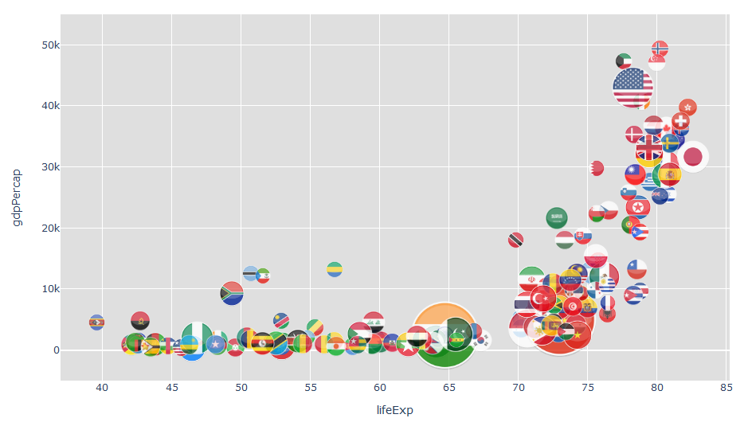
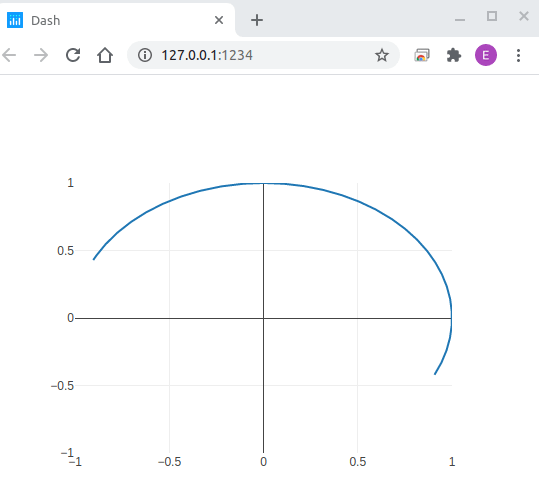
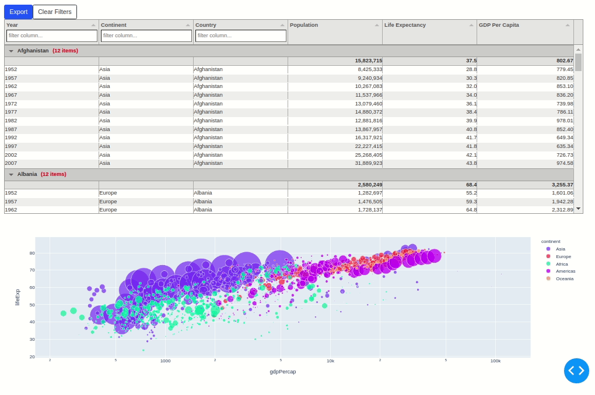
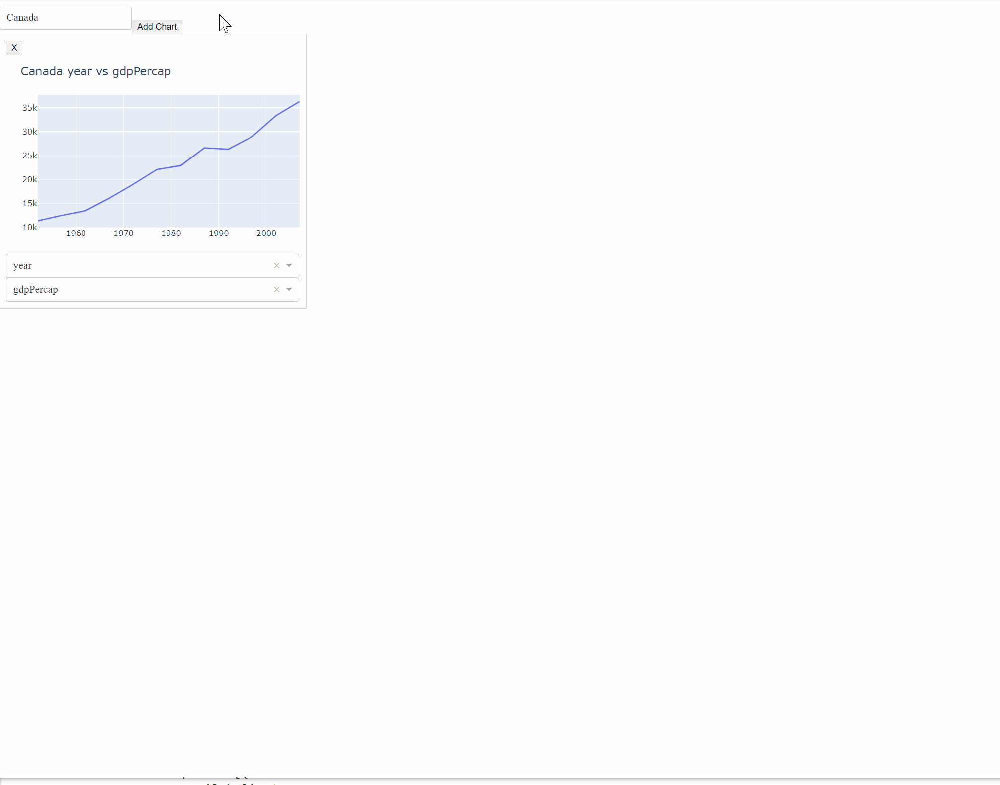

# Where to find cool dash apps

### __Use these apps for inspiration:__

- [Plotly Dash app gallery](https://dash-gallery.plotly.host/Portal/)

- [Show-and-tell category in the Dash Community Forum](https://community.plotly.com/tag/show-and-tell)
---
### __Example apps that can be used as templates:__

- [Graph with images inside bubble](https://community.plotly.com/t/put-images-inside-bubbles/41364/2)

--

- [Dash with real time data](stackoverflow.com/questions/63589249/plotly-dash-display-real-time-data-in-smooth-animation/63681810#63681810)

--

- [dash-tabulator table filters updating a graph](https://community.plotly.com/t/tabulator-dash-component/42261/21?u=annmariew)

-

 - [Pattern Matching callbacks](https://community.plotly.com/t/pattern-call-backs-regarding-adding-dynamic-graphs/40724/3)

--

